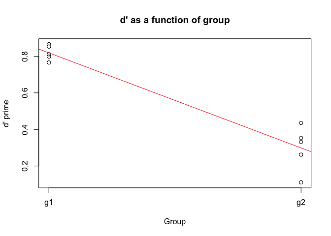

lingStuff
=========

This is a collection of functions that I often use 
in my research. Some are borrowed and edited, others 
are my own. Feel free to fork and edit as you see fit. 

## Installation

In order to install this package you must have `devtools`. Don't know if you have `devtools`? Copy and paste this into your console:


```r
if (!require('devtools')) {
  stop('The package foo was not installed')
}
```

R will load `devtools` if you have it, otherwise it will give you an error, in which case you should copy and paste the following code into the console:


```r
install.packages("devtools")
library(devtools)
install_github("jvcasill/lingStuff")
```

In the case that you already have `devtools`, then just copy and paste lines 2 and 3 of the above code chunk. 

## To add

- contrast coef calculation

## Examples

### D' (d prime)


```r
library(lingStuff); library(dplyr); library(pander)

# Create some data
set.seed(1)
axb <- data.frame(subj = sort(rep(1:10, each = 20, times = 10)),
                  group = gl(2, 1000, labels = c("g1", "g2")),
                  hit = c(rbinom(1000, size = c(0, 1), prob = .8), 
                          rbinom(1000, size = c(0, 1), prob = .6)),
                  fa =  c(rbinom(1000, size = c(0, 1), prob = .3), 
                          rbinom(1000, size = c(0, 1), prob = .4))
    )

# Calculate d prime for each subject
# by group, plot it, and run a 
# linear model
axb %>%
  group_by(subj, group) %>%
  summarize(hRate = mean(hit), 
            faRate = mean(fa), 
            dp = dPrime(hRate, faRate)) %T>%
  {
    plot(dp ~ as.numeric(group), data = ., 
    main = "d' as a function of group", xaxt = "n", 
    xlab = "Group", ylab = "d' prime")
    axis(1, at = 1:2, labels = c("g1", "g2"))
    abline(lm(dp ~ as.numeric(group), data = .), col = "red")
  } %>%
  lm(dp ~ group, data = .) %>%
  pander()
```

 

--------------------------------------------------------------
     &nbsp;        Estimate   Std. Error   t value   Pr(>|t|) 
----------------- ---------- ------------ --------- ----------
   **groupg2**     -0.5199     0.05746     -9.047   1.783e-05 

 **(Intercept)**    0.8185     0.04063      20.15   3.849e-08 
--------------------------------------------------------------

Table: Fitting linear model: dp ~ group
