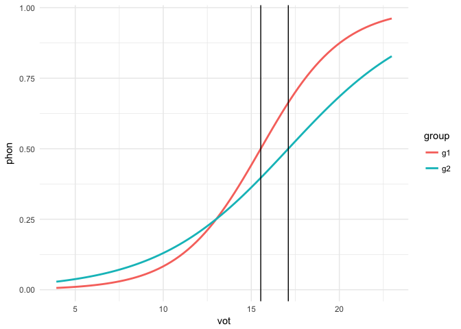

Overview
--------

This is a collection of `R` functions that I often use in my research.
Some are borrowed and edited, others are my own. Feel free to fork and
edit as you see fit.

### Current functions

-   `A`: Calculate A (discrimination experiments)
-   `aPrime`: Calculate A' (discrimination experiments)
-   `b`: Calculate B (discrimination experiments)
-   `biVarPlot`: Fit a linear model to two variables and plot the
    results
-   `bPrimed`: Calculate b''d (b double prime d) (discrimination
    experiments)
-   `cross_over`: Calculate 50% crossover point between categorical
    dependent variable (logistic regression)
-   `dPrime`: Calculate d' (discrimination experiments)
-   `eb`: Wrapper function for `barplot()` that adds error bars
-   `euc.dist`: Calculate the euclidean distance between points/vowels
    (production experiments)
-   `inv_logit`: Calculate the inverse logit from a GLM object (log odds
    to probability)

### Data sets

These have been moved to the `untidydata` package.

Installation
------------

In order to install this package you must have devtools and version
3.1.3 of R. Don't know if you have devtools? Copy and paste this into
your console:

    if (!require('devtools')) {
      stop('The package devtools is not installed')
    }

R will load devtools if you have it, otherwise it will give you an
error, in which case you should copy and paste the following code into
the console:

    install.packages("devtools")
    library(devtools)
    install_github("jvcasill/lingStuff")

If you already have devtools then you only need to copy and paste lines
2 and 3 of the above code chunk.

Examples
--------

Here are some examples of the functions. You might want to install
`tidyverse` if you haven't already.

### crossOver

    library(lingStuff); library(tidyverse); library(pander)

    # Generate data
    set.seed(1)
    vot <- rnorm(20, 15, 5)
    vot <- sort(vot)
    phon1 <- c(0,1,0,0,0,0,0,1,0,1,0,1,0,1,1,1,1,1,1,1)
    group1 <- rep('g1', 20)
    df1 <- data.frame(vot = vot, phon = phon1, group = group1)
    phon2 <- c(1,0,0,0,0,0,0,0,0,0,0,1,0,1,1,1,1,1,1,1)
    group2 <- rep('g2', 20)
    df2 <- data.frame(vot = vot, phon = phon2, group = group2)
    df <- rbind(df1, df2)

    # Fit models
    glm1 <- glm(phon ~ vot, data = df, family = "binomial")
    glm2 <- glm(phon ~ vot * group, data = df, family = "binomial")

    # Get crossover points
    cross_over(mod = glm1, cont_pred = 'vot')

    ## [1] 16.20771

    cross_over(mod = glm2, cont_pred = 'vot')

    ## [1] 15.53595

    cross_over(mod = glm2, cont_pred = 'vot', grouping_var = TRUE, 
               int_adj = 'groupg2', slope_adj = 'vot:groupg2')

    ## [1] 17.10169

    # Plot regression with crossover point
    ggplot(df, aes(x = vot, y = phon, color = group)) + 
      geom_smooth(method = 'glm', method.args = list(family = 'binomial'), se = F) + 
      geom_vline(xintercept = cross_over(mod = glm2, cont_pred = 'vot')) +
      geom_vline(xintercept = cross_over(mod = glm2, cont_pred = 'vot', 
                                         grouping_var = T, int_adj = 'groupg2', 
                                         slope_adj = 'vot:groupg2')) + 
      theme_minimal()

### To add

-   Contrast coefficients
