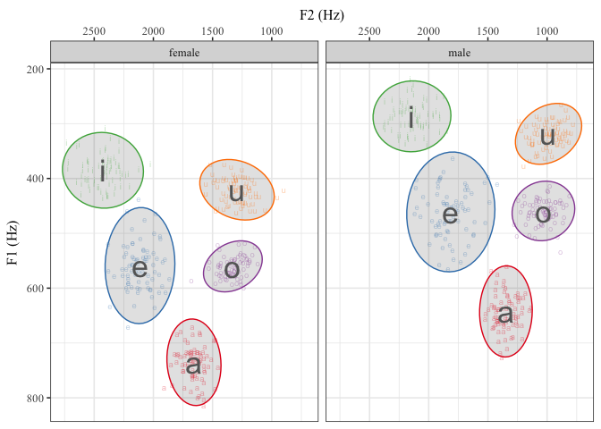

Overview
--------

This is a collection of `R` functions that I often use in my research.
Some are borrowed and edited, others are my own. Feel free to fork and
edit as you see fit.

### Current functions

-   `A`: Calculate A (discrimination experiments)
-   `aPrime`: Calculate A' (discrimination experiments)
-   `b`: Calculate B (discrimination experiments)
-   `biVarPlot`: Fit a linear model to two variables and plot the
    results
-   `bPrimed`: Calculate b''d (b double prime d) (discrimination
    experiments)
-   `cross_over`: Calculate 50% crossover point between categorical
    dependent variable (logistic regression)
-   `dPrime`: Calculate d' (discrimination experiments)
-   `eb`: Wrapper function for `barplot()` that adds error bars
-   `euc.dist`: Calculate the euclidean distance between points/vowels
    (production experiments)
-   `inv_logit`: Calculate the inverse logit from a GLM object (log odds
    to probability)
-   `lm_ex`: Creates a scatter plot and fits a linear model. Used for
    teaching.
-   `vowel_plot`: Takes a dataframe of formant data and creates a vowel
    plot.

### Data sets

These have been moved to the
[untidydata](https://github.com/jvcasillas/untidydata) package.

Installation
------------

In order to install this package you must have devtools and version
3.1.3 of R. Don't know if you have devtools? Copy and paste this into
your console:

    if (!require('devtools')) {
      stop('The package devtools is not installed')
    }

R will load devtools if you have it, otherwise it will give you an
error, in which case you should copy and paste the following code into
the console:

    install.packages("devtools")

Now that you have `devtools` installed, you can install `lingStuff`.

    devtools::install_github("jvcasill/lingStuff")

Examples
--------

Here are some examples of the functions. You might want to install
`tidyverse` if you haven't already.

### vowel\_plot

    library(lingStuff)
    library(tidyverse)
    library(untidydata)

    spanish_vowels %>% 
      separate(., col = label, into = c('id', 'gender', 'vowel'), sep = "-") %>% 
      vowel_plot(data = ., vowel = 'vowel', f1 = 'f1', f2 = 'f2', group = 'gender')

    ##    vowel gender       f1        f2
    ## 1      a female 735.1713 1657.2717
    ## 2      e female 558.8545 2113.2856
    ## 3      i female 385.0679 2426.1463
    ## 4      o female 560.2237 1328.5739
    ## 5      u female 420.5353 1293.4553
    ## 6      a   male 642.3957 1347.9507
    ## 7      e   male 460.9596 1813.4000
    ## 8      i   male 286.6176 2141.5392
    ## 9      o   male 459.1942 1031.0266
    ## 10     u   male 318.6032  987.9089

### To add

-   Contrast coefficients
